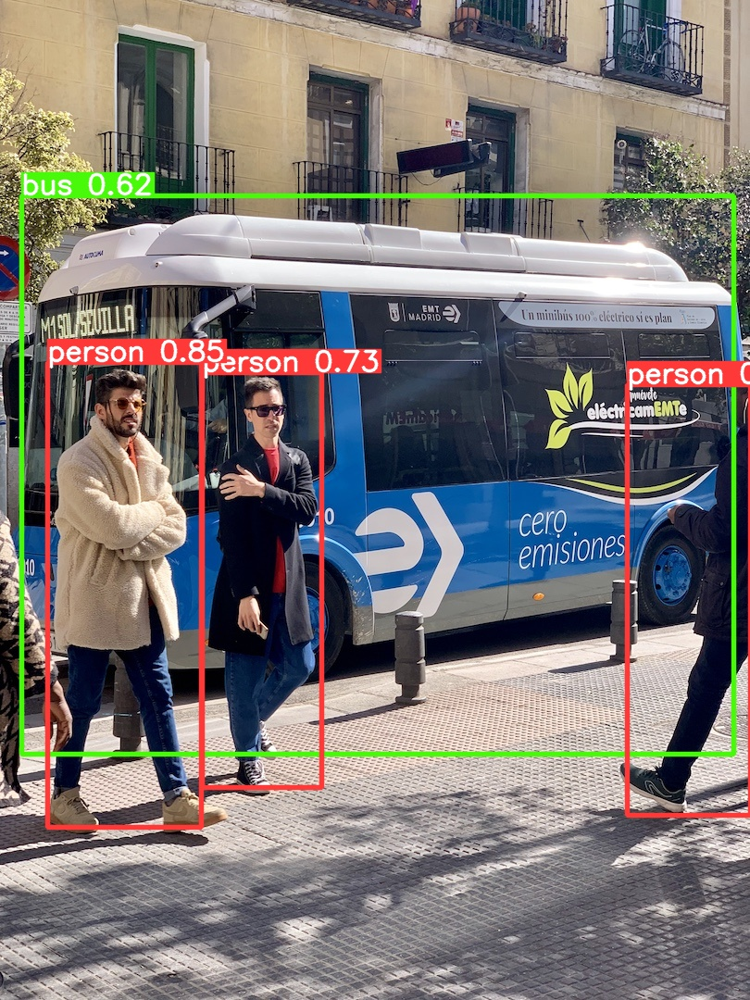

<div align="right">
  Language:
    🇺🇸
  <a title="Chinese" href="./README.zh-CN.md">🇨🇳</a>
</div>

<div align="center"><a title="" href="https://github.com/zjykzj/YOLOv5"></a></div>

<p align="center">
  «YOLOv5» implements a tiny version of the original <a href="https://github.com/ultralytics/yolov5">ultralytics/yolov5</a>
<br>
<br>
  <a href="https://github.com/RichardLitt/standard-readme"></a>
  <a href="https://conventionalcommits.org"></a>
  <a href="http://commitizen.github.io/cz-cli/"></a>
</p>

## Table of Contents

- [Table of Contents](#table-of-contents)
- [Background](#background)
- [Usage](#usage)
  - [Train](#train)
  - [Eval](#eval)
  - [Predict](#predict)
- [Maintainers](#maintainers)
- [Thanks](#thanks)
- [Contributing](#contributing)
- [License](#license)

## Background

[ultralytics/yolov5](https://github.com/ultralytics/yolov5) provides a perfect object detection implementation, including the advanced yolov5 model and loss function, as well as perfect logging and debugging functions. For beginners, training, testing, and deployment of object detection tasks can be completed through documentation, and even [ultralytics/yolov5](https://github.com/ultralytics/yolov5) provides SOP for classification and segmentation tasks.

This repository aims to implement a simplified version of YOLOv5, simplifying the internal implementation of the
original YOLOv5 repository as much as possible, and removing features and code that I currently do not need. For
example, I will remove the implementation code for video files and cache files in the data module, and only retain the
onnxruntime/opencv implementation in the deployment module, and so on.

**Note1: The implementation of yolov5 for this warehouse is referenced from [v7.0 - YOLOv5 SOTA Realtime Instance Segmentation](https://github.com/ultralytics/yolov5/releases/tag/v7.0).**

**Note2: The configuration of this warehouse is completely based on the original implementation of YOLOv5, divided into `configs/data/*.yaml`, `configs/hyps/*.yaml`, `configs/models/*.yaml`.**

## Usage

### Train

* Detect

```shell
python -m torch.distributed.run --nproc_per_node 4 --master_port 53122 train.py --data coco.yaml --weights "" --cfg yolov5s.yaml --img 640 --device 0,1,2,3
```

* Classify

```shell
python -m torch.distributed.run --nproc_per_node 4 --master_port 25123 classify/train.py --model yolov5s-cls.pt --data imagenet --img 224 --epochs 90 --device 0,1,2,3
```

### Eval

* Detect

```shell
python val.py --weights yolov5s.pt --data coco.yaml --img 640
python val.py --weights yolov5s_voc.pt --data VOC.yaml --img 640
```

| Model                                                                                     | size<br><sup>(pixels) | dataset<br> | mAP<sup>val<br>50-95 | mAP<sup>val<br>50 | Speed<br><sup>PyTorch RTX3090<br>(ms) | params<br><sup>(M) | FLOPs<br><sup>@640 (B) |
|-------------------------------------------------------------------------------------------|-----------------------|-------------|----------------------|-------------------|---------------------------------------|--------------------|------------------------|
| [YOLOv5x](https://github.com/zjykzj/YOLOv5/releases/download/v1.0/yolov5x.pt)             | 640                   | COCO        | 48.1                 | 66.7              | 19.7                                  | 86.71              | 205.5                  |
| [YOLOv5l](https://github.com/zjykzj/YOLOv5/releases/download/v1.0/yolov5l.pt)             | 640                   | COCO        | 46.2                 | 65.2              | 11.7                                  | 46.53              | 109.0                  |
| [YOLOv5m](https://github.com/zjykzj/YOLOv5/releases/download/v1.0/yolov5m.pt)             | 640                   | COCO        | 42.9                 | 62.1              | 22.8                                  | 21.17              | 48.9                   |
| [YOLOv5n](https://github.com/zjykzj/YOLOv5/releases/download/v1.0/yolov5n.pt)             | 640                   | COCO        | 24.4                 | 41.3              | 3.5                                   | 1.87               | 4.5                    |
| [YOLOv5s](https://github.com/zjykzj/YOLOv5/releases/download/v1.0/yolov5s.pt)             | 640                   | COCO        | 34.7                 | 53.8              | 3.6                                   | 7.23               | 16.4                   |
| [YOLOv3](https://github.com/zjykzj/YOLOv5/releases/download/v1.0/yolov3.pt)               | 640                   | COCO        | **43.6**             | **63.7**          | 8.0                                   | 61.92              | 155.9                  |
|                                                                                           |                       |             |                      |                   |                                       |                    |                        |
| [YOLOv5s](https://github.com/zjykzj/YOLOv5/releases/download/v1.0/yolov5s_voc.pt)         | 640                   | VOC         | 46.8                 | 73.8              | 2.3                                   | 7.06               | 15.9                   |
| [YOLOv3](https://github.com/zjykzj/YOLOv5/releases/download/v1.0/yolov3_voc.pt)           | 640                   | VOC         | **56.9**             | **81.9**          | 7.1                                   | 61.60              | 154.9                  |
| [YOLOv3-Tiny](https://github.com/zjykzj/YOLOv5/releases/download/v1.0/yolov3-tiny_voc.pt) | 640                   | VOC         | 25.3                 | 54.2              | 1.9                                   | 8.71               | 13.0                   |

* Classify

```shell
python classify/val.py --weights yolov5s-cls.pt --data ../datasets/imagenet --img 224
```

| Model                                                                                             | size<br><sup>(pixels) | acc<br><sup>top1 | acc<br><sup>top5 | Training<br><sup>90 epochs<br>4xRTX3090 (hours) | Speed<br><sup>PyTorch RTX3090<br>(ms) | params<br><sup>(M) | FLOPs<br><sup>@224 (B) |
|---------------------------------------------------------------------------------------------------|-----------------------|------------------|------------------|-------------------------------------------------|---------------------------------------|--------------------|------------------------|
| [YOLOv5s-cls](https://github.com/zjykzj/YOLOv5/releases/download/v1.0/yolov5s-cls.pt)             | 224                   | 64.9             | 86.0             | 38.831                                          | **0.3**                               | **6.45**           | **11.4**               |
| [YOLOv3-cls](https://github.com/zjykzj/YOLOv5/releases/download/v1.0/yolov3-cls.pt)               | 224                   | 68.3             | 88.2             | 56.517                                          | **1.0**                               | **16.81**          | **98.6**               |
| [EfficientNet-B0](https://github.com/zjykzj/YOLOv5/releases/download/v1.0/efficientnet-b0-cls.pt) | 224                   | 71.0             | 90.2             | 77.515                                          | **0.5**                               | **5.3**            | **1.0**                |

### Predict

```shell
python detect.py --weights yolov5n.pt --source assets/coco/
```

<p align="left">  </p>

```shell
python classify/predict.py --weights yolov5s-cls.pt --source assets/imagenet-val/ --imgsz 224
```

<p align="left">  </p>

## Maintainers

* zhujian - *Initial work* - [zjykzj](https://github.com/zjykzj)

## Thanks

* [ultralytics/yolov5](https://github.com/ultralytics/yolov5)
* [zjykzj/YOLOv3](https://github.com/zjykzj/YOLOv3)

## Contributing

Anyone's participation is welcome! Open an [issue](https://github.com/zjykzj/YOLOv5/issues) or submit PRs.

Small note:

* Git submission specifications should be complied
  with [Conventional Commits](https://www.conventionalcommits.org/en/v1.0.0-beta.4/)
* If versioned, please conform to the [Semantic Versioning 2.0.0](https://semver.org) specification
* If editing the README, please conform to the [standard-readme](https://github.com/RichardLitt/standard-readme)
  specification.

## License

[Apache License 2.0](LICENSE) © 2023 zjykzj